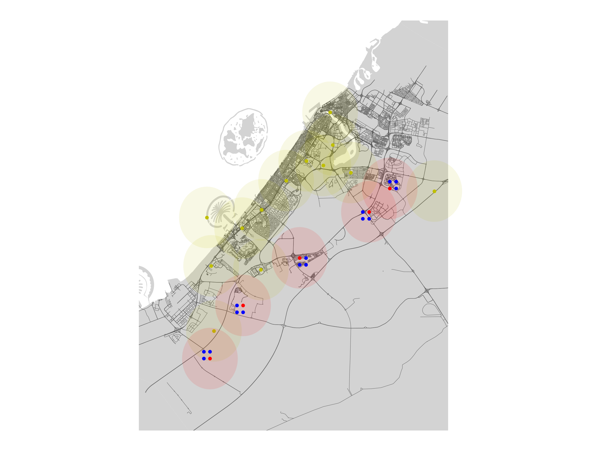

# Electric Vehicle Charger Placement

Objective: 
- Minimize Costs
- Minimize travel time between nearby chargers

Constraints:
- Minimize distance between nearby chargers (nearby is flexible)
- One charger per zone (number per zone is flexible)
- Prefer high traffic build sites (traffic information is flexible - using vehicles per hour)

Inputs:
- Existing charger information: name / lat / long / traffic
- Build site information: zone / sector / lat / long / traffic

Outputs: Map of charger network
- Yellow: existing chargers
- Red: selected build sites for new chargers
- Blue: non-selected build sites for new chargers

